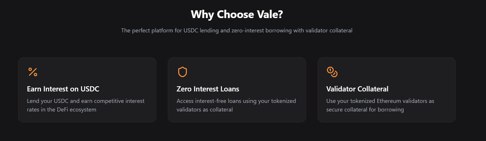
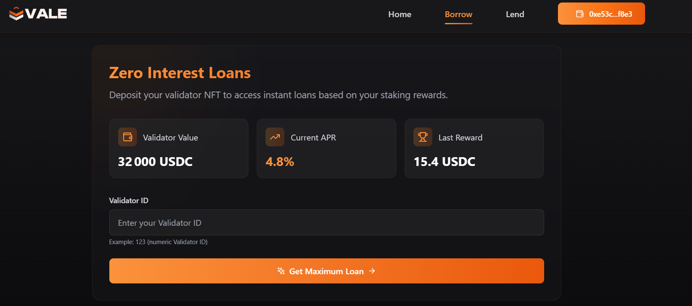
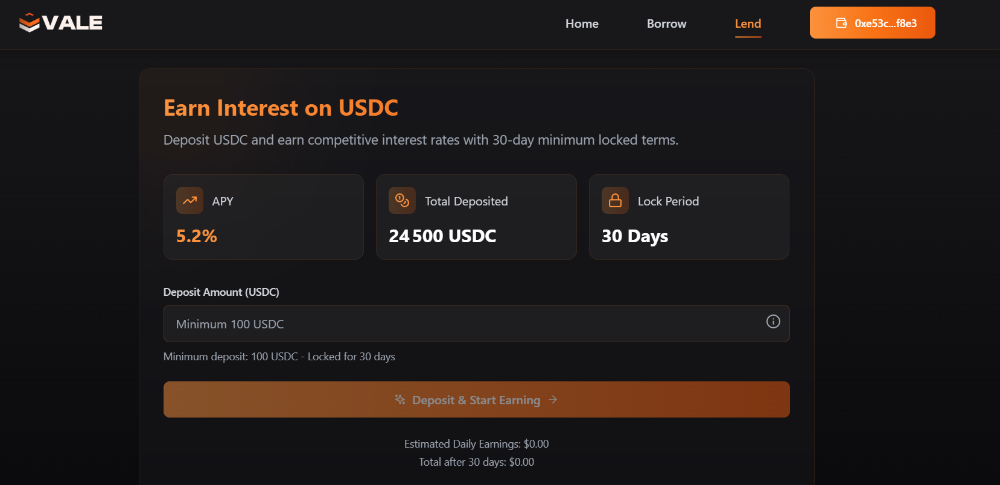

# Vale - Zero-Interest Lending for Tokenized Validators

Vale enables Tokenized Validator holders to access immediate liquidity through zero-interest loans while letting lenders earn staking rewards.

<div align="center">
  
  
</div>

## 🌟 Overview

Vale solves the liquidity problem for staked ETH:
- Borrow against your Validator NFT without interest
- Get immediate liquidity without unstaking
- Earn staking rewards as a lender
- Protection against slashing risks

## 💡 How It Works

### For Borrowers
- Deposit your Validator NFT as collateral
- Borrow up to 84% of its value in USDC (e.g., 27 ETH worth for a 32 ETH NFT)
- Repay the same amount to get your NFT back
- No interest payments required
- Staking rewards are used to compensate lenders

<div align="center">
  
</div>

### For Lenders
- Deposit funds into the ERC4626 vault
- Receive tokens representing your pool share
- Earn a portion of staking rewards from NFTs
- Returns scale with pool utilization
- Protected against validator slashing risks

<div align="center">
  
</div>

## 🛡️ Risk Management

### Slashing Protection
If a validator's value drops below 32 ETH:
- Borrower loses NFT access
- Loan is forgiven
- Lenders are protected from validator risks

### Reward Distribution
- Staking rewards from NFTs are tracked via Kiln Connect
- Rewards are distributed based on pool share
- Higher pool utilization = higher rewards for lenders

## 🏗️ Technical Stack

- **Smart Contracts**: Solidity, ERC4626 vault, ERC721 for NFTs
- **Frontend**: React, Web3.js
- **Backend**: Python for reward calculations
- **Integration**: Kiln Connect for validator data

## 🚀 Quick Start

### Prerequisites
- Node.js (v16+)
- Python 3.8+
- Hardhat
- Metamask

### Setup

1. Configure environment variables
```bash
cp hardhat/.env.example hardhat/.env
cp python/.env.example python/.env
```

2. Frontend
```bash
cd frontend
npm install
npm run dev
```

3. Smart Contracts
```bash
cd hardhat
npm install
npx hardhat compile
```

Oracle Contract (Goerli): `0x751FcE6b427d4b27A8a8AF0269bc392242f77008`

4. Python Backend
```bash
cd python
pip install -r requirements.txt
python3 main.py
```
